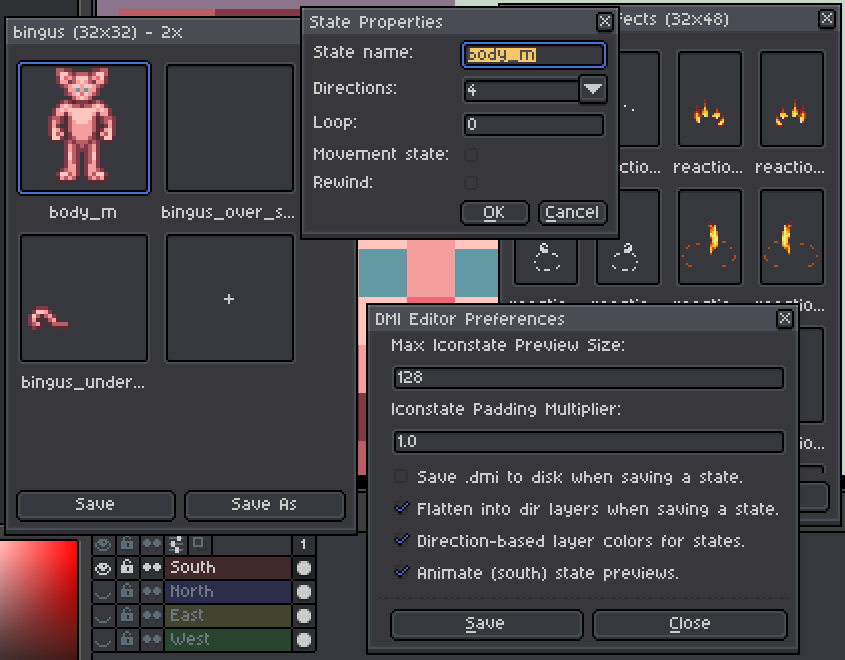

# DMI Editor for Aseprite

This project is a DMI (BYOND's Dream Maker icon files) editor extension for [Aseprite](https://www.aseprite.org), a popular pixel art tool. It is written in Rust and Lua and aims to enhance the Aseprite experience by providing tools for editing and managing DMI files.

## Download

The latest version of this extension is available for download from the [Releases](https://github.com/spacestation13/aseprite-dmi/releases) page.
The plugin will also prompt you to download an update when a new version is released.

**Requires Aseprite v1.3.18-beta3 or later.**

## Usage

Once the project has been downloaded or built, the extension can be added to Aseprite by dragging and dropping it into the application or by selecting the 'Add Extension' button in the 'Edit > Preferences > Extensions' menu.

**DMI files can be opened in Aseprite in the same way as any other file format.**

### Linux

Unfortunately, due to dynamic library linking issues, **Aseprite running on Linux via Steam is not supported.**

Running a Windows build via Wine works just fine (reportedly), and is what we recommend.

### Creating New Files

New files can be created via: `File > DMI Editor > New DMI File`

### Changing Iconstate Properties

The state properties, including the state name, can be modified by right clicking on the state or by clicking on the text below the state in the editor.

### Copy and Paste

Right-clicking on the state will bring up the context menu. The context menu allows the user to copy the state to the clipboard, which can then be pasted at a later stage. Right click on an empty space within the editor to paste the copied state. The states are copied in the JSON format, with PNG images, which are base64-encoded, included for the frames.

### Expand, Resize, Crop

The DMI file may be expanded, resized, or cropped via the `File > DMI Editor` menu.

### Plugin Preferences

Under the `File > DMI Editor` menu, there is an `Preferences` menu which contains various options.

## Building the Project

### Requirements

-   [Rust](https://www.rust-lang.org/)
-   [Python](https://www.python.org/) (build script)

To build the project, run `tools/build.py` Python script.

### Releasing

Push a git tag like `v1.0.8`, after changing the Cargo.toml and package.json files.

## LICENSE

**GPLv3**, for more details see the [LICENSE](./LICENSE).

Originally created by [Seefaaa](https://github.com/Seefaaa) at https://github.com/Seefaaa/aseprite-dmi
